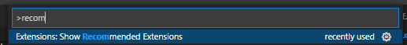
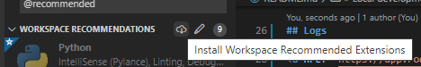
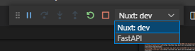

# Nuxt3 + FastAPI boilerplate <!-- omit in toc -->

<!-- badges: start -->

<!-- badges: end -->


- [Environments](#environments)
  - [Logs](#logs)
- [Local development](#local-development)
  - [Docker configuration](#docker-configuration)
  - [VSCode Extensions](#vscode-extensions)
  - [Installing dependencies](#installing-dependencies)
    - [FastAPI](#fastapi)
    - [Node](#node)
  - [Running and debugging the APP](#running-and-debugging-the-app)
    - [Manual launch](#manual-launch)
  - [Debugging launch](#debugging-launch)
- [More information](#more-information)


# Environments


- [Development]
- [QA]
- [Production]

## Logs


# Local development

## Docker configuration

The repository contains a docker configuration and a Dockerfile inside the folder `.devcontainer` to work with Docker and VSCode from within the container.

When the repository folder is opened in VSCode, it should prompt to reopen the folder in the container and automatically build and install python dependencies.

**Before opening the project in the container**, an environment file is needed:

1. Create a file in the root `.env`
2. Define the variables that are needed for the project

The rest of the needed variables can be looked up in the CI settings of GitLab.

Open VSCode from the container by clicking the prompt or **opening the command palette** (ctrl + shift + p) and search for 'Open folder in Container'.

## VSCode Extensions

There are useful extensions that makes the development easier. To install the recommended extensions go to the recommended extensions menu (2 options):

- Click on the extensions icon in the left menu and search for `@recommended` or:
- Open the command palette (ctrl + shift + p) and search for recommended:

<p align="center">
	
</p>

In the menu, click the cloud icon to install all recommended extensions:

<p align="center">
	
</p>


## Installing dependencies

### FastAPI

If the project is used from VSCode from the Docker container, the dependencies should be already installed when building the container.

#### Manual install <!-- omit in toc -->

You need a working local Python development environment (ref: [Python setup guide](https://developer.docs.basf.net/setup/python/) on [Developer Documentation](https://developer.docs.basf.net/))

Install all python dependencies using `pip`:

```sh
cd fastapi
pip install -r requirements.txt
```

### Node

To install node dependencies run:

```sh
cd nuxt
npm i -y
```

## Running and debugging the APP

The backend can be developed separately calling the endpoints via the Swagger page or using Postman or similar, while the frontend needs the backend to be running for most of the functionality.

There are two ways of running the app:

1. Manual launch
2. Using launch.json file -> **allows for debugging**


### Manual launch

**Backend**

In a new terminal (ctrl + shift + p -> create new terminal) run:

```sh
cd fastapi
python3 debug.py
```

The server runs at `localhost:5000`.

**Frontend**

In a new terminal (ctrl + shift + p -> create new terminal) run:

```sh
cd nuxt
npm run dev
```

Server runs in `localhost:3000`.

## Debugging launch

See [VSCode debug documentation](https://code.visualstudio.com/docs/editor/debugging) for more details on how the debugger works in VSCode.

To launch the application to debug the code in VSCode, go to "Run and debug" by clicking on the left menu (Bug & play icon) and on the dropdown menu there are several configurations:

- **Nuxt: dev**: launches nuxt frontend in a debug terminal
- **Nuxt client: chrome**: launches a new chrome instance with the debugger attached
- **Fastapi**: launches the backend with the debugger attached

There is also the **Full StApp** configuration that launches the three configurations mentioned above. Running this configuration allows to **debug both frontend and backend simultaneusly.**

The only thing to consider is **where to set the breakpoints:**

> If we want to add a breakpoint in by clicking any code line number,
> make sure that the selected configuration at the top is the corresponding debugger configuration:
>
> - "FastAPI" for debugging backend code
>
> - "Nuxt: dev" for debugging frontend code

<p align="center">
	
</p>


# More information

- [Backend](fastapi/README.md)
- [Frontend](nuxt/README.md)
